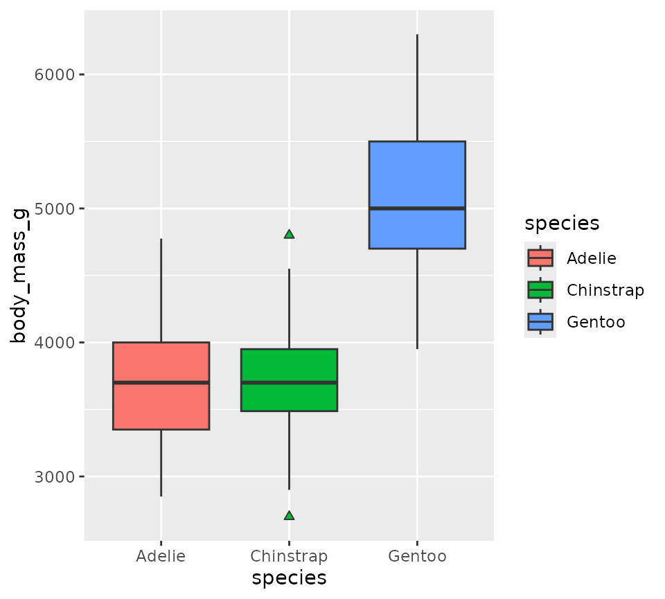
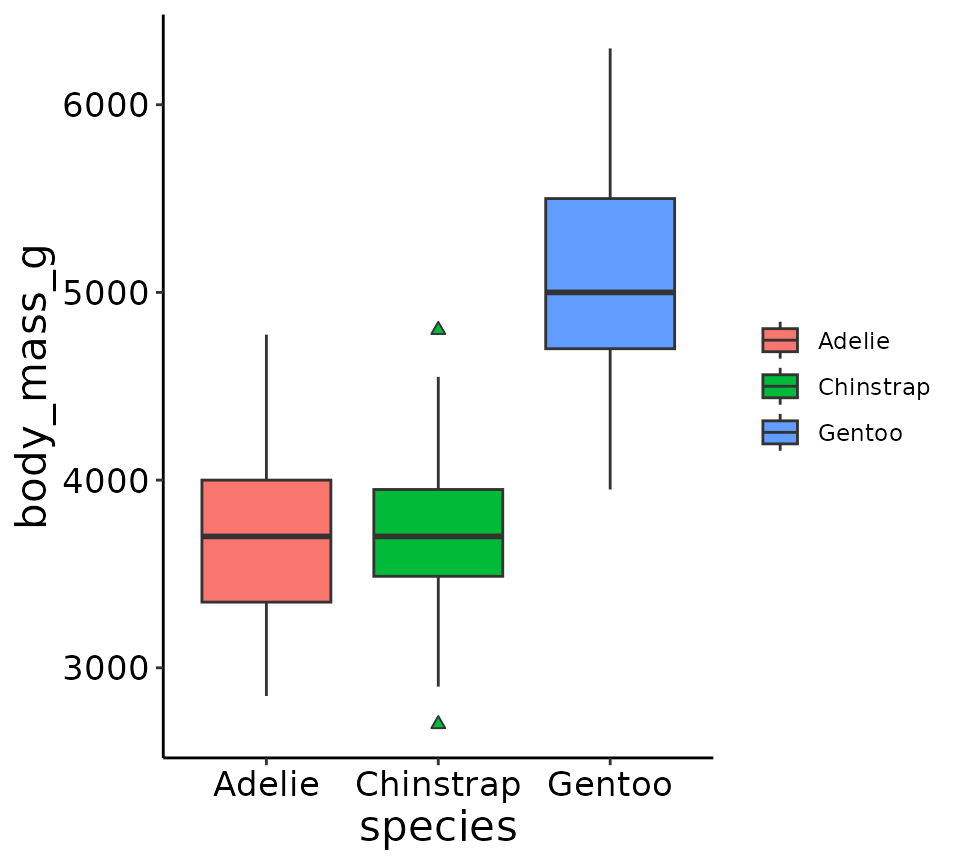
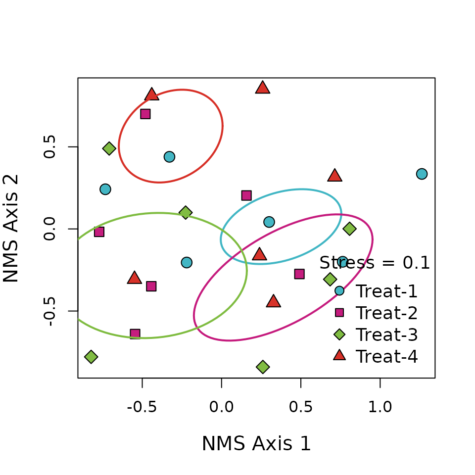

# Data Visualization

## Overview

The `supportR` package is an amalgam of distinct functions I’ve written
to accomplish small data wrangling, quality control, or visualization
tasks. These functions tend to be short and narrowly-defined. An
additional consequence of the motivation for creating them is that they
tend to not be inter-related or united by a common theme. If this
vignette feels somewhat scattered because of that, I hope it doesn’t
negatively affect how informative it is or your willingness to adopt
`supportR` into your scripts!

This vignette describes the main functions of `supportR` using the
examples included in each function.

``` r
#install.packages("supportR")
library(supportR)
```

### Example Data

In order to demonstrate some of the data visualization functions of
`supportR`, we’ll use some some example data from Dr. [Allison
Horst](https://allisonhorst.com/allison-horst)’s [`palmerpenguins` R
package](https://github.com/allisonhorst/palmerpenguins).

``` r
# Check the structure of the penguins dataset
str(penguins)
#> 'data.frame':    344 obs. of  8 variables:
#>  $ species          : Factor w/ 3 levels "Adelie","Chinstrap",..: 1 1 1 1 1 1 1 1 1 1 ...
#>  $ island           : Factor w/ 3 levels "Biscoe","Dream",..: 3 3 3 3 3 3 3 3 3 3 ...
#>  $ bill_length_mm   : num  39.1 39.5 40.3 NA 36.7 39.3 38.9 39.2 34.1 42 ...
#>  $ bill_depth_mm    : num  18.7 17.4 18 NA 19.3 20.6 17.8 19.6 18.1 20.2 ...
#>  $ flipper_length_mm: int  181 186 195 NA 193 190 181 195 193 190 ...
#>  $ body_mass_g      : int  3750 3800 3250 NA 3450 3650 3625 4675 3475 4250 ...
#>  $ sex              : Factor w/ 2 levels "female","male": 2 1 1 NA 1 2 1 2 NA NA ...
#>  $ year             : int  2007 2007 2007 2007 2007 2007 2007 2007 2007 2007 ...
```

### Custom `ggplot2` Theme

I’ve created a set of custom `ggplot2` `theme` elements to guarantee
that all of my figures share similar aesthetics. Feel free to use
`theme_lyon` if you have similar preferences!

`theme_lyon` does the following changes to a `ggplot2` plot:

- Removes legend title and background
- Removes gray box behind colors in legend elements
- Removes major/minor gridlines
- Makes axes’ lines black
- Increases the font size of the axes titles and tick labels

``` r
# Load ggplot2
library(ggplot2)

# Create a plot and allow default ggplot themeing to be added
ggplot(penguins, aes(x = species, y = body_mass_g, fill = species)) +
  geom_boxplot(outlier.shape = 24)
```



``` r

# Compare with the same plot with my theme
ggplot(penguins, aes(x = species, y = body_mass_g, fill = species)) +
  geom_boxplot(outlier.shape = 24) +
  supportR::theme_lyon()
```



### Metric & Non-Metric Multidimensional Ordinations

I’ve also created `ordination` for Nonmetric Multidimensional Scaling
(NMS) or Principal Coordinates Analysis (PCoA) ordinations. Note that
this function requires your multidimensional scaling object be created
by either [`ape::pcoa`](https://rdrr.io/pkg/ape/man/pcoa.html) or
[`vegan::metaMDS`](https://vegandevs.github.io/vegan/reference/metaMDS.html).

``` r
# Load data from the `vegan` package
utils::data("varespec", package = "vegan")

# Make a columns to split the data into 4 groups
treatment <- c(rep.int("Trt_1", (nrow(varespec)/4)),
               rep.int("Trt_2", (nrow(varespec)/4)),
               rep.int("Trt_3", (nrow(varespec)/4)),
               rep.int("Trt_4", (nrow(varespec)/4)))

# And combine them into a single data object
data <- cbind(treatment, varespec)

# Actually perform multidimensional scaling
mds <- vegan::metaMDS(data[-1], autotransform = FALSE, 
                      expand = FALSE, k = 2, try = 10)

# With the scaled object and original dataframe we can use this function
supportR::ordination(mod = mds, grps = data$treatment, x = "bottomright",
                     legend = paste0("Treat-", 1:4))
```


